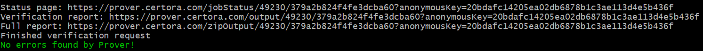
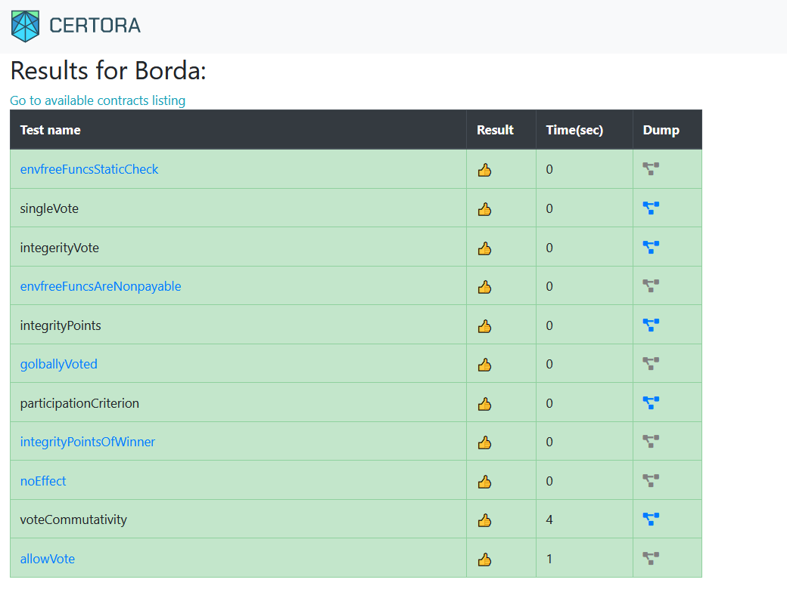

# Certora Prover Supplementary Material
The [Borda count election algorithm](https://en.wikipedia.org/wiki/Borda_count) is a simple election scheme where voters rank candidates in order of preference by giving 3 points to their first choice, 2 for their 2nd choice, and 1 point for the 3rd choice. 

We define `BordaInterface`, a public interface for the Borda algorithm: 
   * `winner(): address`  
   Returns the current winner - the address that has the most points. If there is more than one winner, one of them will be returned. If no votes were cast yet, it returns the zero address.
   * `points(address c): uint256`  
   Returns the number of points candidate c has received.
   * `voted(address x): bool`  
   Returns true if user x voted and false otherwise.  
   * `vote(address f, address s, address t)`  
   msg.sender votes with f as the first choice, s as the second, and t as the third. The three addresses must be different. msg.sender can vote to itself.

[Borda.sol](Borda.sol) contains `BordaInterface` and a contract `Borda` implementing this interface.
[Borda.spec](Borda.spec) contains rules to verify any given implementation this interface.

# Exercise Prerequisites

   * Python 3.5 and up
   * Java 11 or later
   * A solidity compiler version 0.6.0 or later.

# Running the Certora Prover

1. Install the Certora Prover Package: `pip3 install certora-cli`.
2. Set your Certora key: `export CERTORAKEY=795ebbac71ae5fd6a19e7a214a524b064e33ff05`.
4. Edit [run.sh](run.sh) to include the correct path to the solidity compiler after `--solc`.
5. Go to the Challenge folder containing `run.sh`.
6. Execute the script: `./run.sh`. Windows users are recommended to use a [git-bash](https://gitforwindows.org/)/PowerShell or other alternative to windows command prompt 

You should see a similar message to this one 

By opening the `verification report` link you should see a summary of all violation. When no violations are found, the rule should be colored green.

# The challenge

The challenge is to introduce a bug or a malicious code to the `Borda` contract that the automated Certora prover does not detect with the given the [specification file](Borda.spec). Note that you can not change `BordaInterface`. Feel free to change `Borda` as you like and even add additional methods. 

Once you find a bug that the prover does not identify, define a property that will uncover this issue. 
Feel free to reach us with your findings at [our website](https://www.certora.com).
 