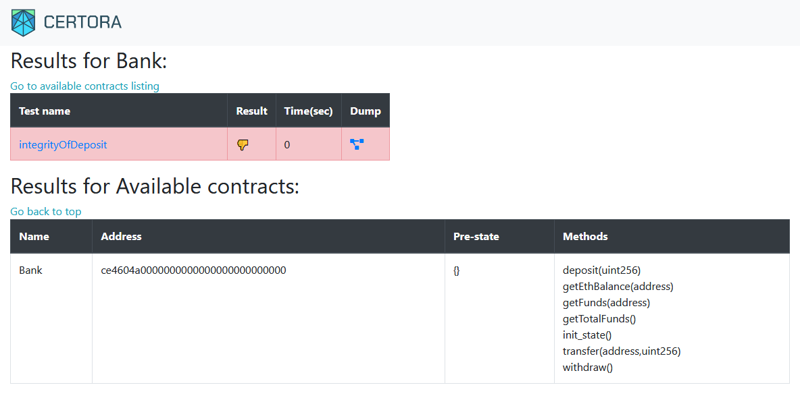
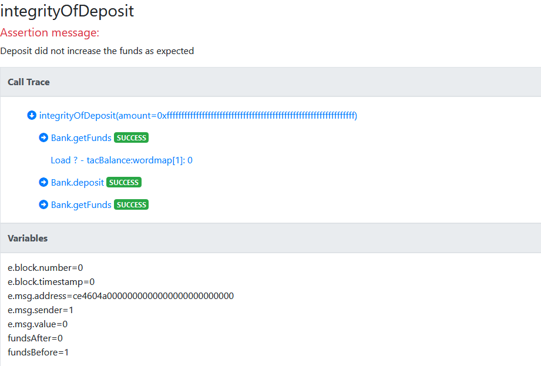

# Certora Prover - Lesson 1 


## Technology Overview 
The Certora Prover is based on well-studied techniques from the formal verification community. 
***Specifications*** define a set of rules that call into the contract under analysis and make various assertions about its behavior. 
Together with the contract under analysis, these rules are compiled to a logical formula called a ***verification condition***, which is then proved or disproved by an SMT solver. 
If the rule is disproved, the solver also provides a concrete test case demonstrating the violation.

The rules of the specification play a crucial role in the analysis. Without adequate rules, only very basic properties can be checked (e.g., no assertions in the contract itself are violated). 
To effectively use Certora Prover, users must write rules that describe the high-level properties they wish to verify on their contracts. 
Here we will learn how to think about and write high-level properties.


## Example

Let's take as an example a straightforward simple bank implementation ([Bank.sol](Bank.sol)).
The contract has a mapping from users to their funds and the total funds deposited in the system. The primary operations are `deposit`, `transfer`, and `withdraw`.

## A Basic Rule

Thinking about the function `deposit`, a basic property is:  
  
  #### _***P1: Correct deposit functionality***: The balance of the beneficiary is increased appropriately_  

The rule in [integrityOfDeposit.spec](IntegrityOfDeposit.spec) verifies this property. 
It verifies that the `deposit` operation increases the funds of `msg.sender` by the deposited amount.  
Formal verification can provide complete coverage of the input space, giving guarantees beyond what is possible from testing alone.
All possible inputs to the deposit function (all possible deposited amounts) are taken into account. 
Additionally, all possible calling contexts are considered. Certora prover represents the calling context through the struct variable `env`. Declaring a single `env` variable suffices to capture all aspects of the calling contexts, but they can also be addressed individually.
Some example aspects of the calling context are:
 - "Who is the depositor?" (`env.msg.sender`)
 - "In which block does the deposit occur?" (`env.block.number`)
 - "At which time does the deposit occur?" (`env.block.timestamp`)
 - (and many more)
 
Notice that each function must get an `env` variable as its first parameter:
`deposit(e, amount);`.

By default, the Certora prover will ignore all paths where any function call reverts, and they will not be considered violations of the rule.
We will learn more about this topic in the next lesson.

To use the Certora Prover on this contract, run the following command line:

```sh
certoraRun Bank.sol --verify Bank:IntegrityOfDeposit.spec
```

This command triggers a verification run on the contract `Bank` in the solidity file `Bank.sol`, checking all rules in the specification file. 
Later on, we will see options to analyze a system containing many solidity files.
The command proceeds in two steps.
First, the solidity files are compiled, and the specification file is checked for syntax errors. This step happens on the local machine for fast feedback. 
Next, all necessary files are compressed and sent to Certora’s web server for verification (verification tasks can be very heavy, so running them in the cloud can help with scalability).
The prover will print various information to the console. 
An email will be sent when the process is finished.
In the end, the output will look similar to this:
```
. . . 
Status page: https://vaas-stg.certora.com/jobStatus/23658/e145eb5d7d5f2dea1f72?anonymousKey=f49a8d71d3d17288d8405c015
Verification results: https://vaas-stg.certora.com/output/23658/e145eb5d7d5f2dea1f72/?anonymousKey=f49a8d71d3d17288d8405c0150
Prover found violations:
[rule] callTraceProblem
[rule] integrityOfDeposit
```
Follow the "Verification results" link to see the results.
You see a table with the verification results, similar to this image.  
For each rule, the table either displays a thumbs-up when the rule is was proved or a thumbs-down when a violation of the rule was discovered.

## Understanding Rule Violations

Certora Prover helps in understanding violations of properties. 

Click the rule name to see a counter-example violating the rule.

 

The counter-example shows values of the rule's parameters and variables and a call trace.
You can investigate the call trace to see which functions were called.
Notice the values of variables: 
* The amount deposited in `deposit(e, amount);` is MAX_UINT.
* The `uint256 fundsBefore = getFunds(e, e.msg.sender)` is one.
* The `uint256 fundsAfter = getFunds(e, e.msg.sender)` is zero. 

So, what's the bug?  
**The rule does not hold when an overflow occurs.**

Let's “fix” the overflow bug in the code and rerun:
```sh 
certoraRun BankFixed.sol:Bank --verify Bank:IntegrityOfDeposit.spec
```


No violations were found. Great!

## Preconditions and Helper Variables

Let’s define [another property](Sanity.spec) and verify that after deposit, the totalFunds in the system is at least the funds of the msg.sender:  
  
 #### _***P2: Sanity of deposit***: total funds >= funds of the single user_
  


run:  
```sh
certoraRun BankFixed.sol:Bank --verify Bank:Sanity.spec --settings -rule=totalFundsAfterDeposit
```

Notice the useful option of `-rule` to run one rule at a time.

A violation is found. 
Do you understand why?  
Adding additional variables to the rule can help understand the counter-example. 
Try adding the ***helper variables*** `userFundsBefore` and `totalBefore`.

As we discussed, the tool assumes all possible input values as a starting state. 
The rule is violated when the initial state's totalFunds is less than the current funds of msg.sender. 
By adding ***preconditions***, you can eliminate infeasible states and put constraints on values. 
Rule `totalFundsAfterDepositWithPrecondition` has the constraint 
`require  getTotalFunds(e) >= getFunds(e, e.msg.sender);`.

The prover will now assume that in the initial state before calling deposit, the total funds are at least the user's funds.
```sh
certoraRun BankFixed.sol:Bank --verify Bank:Sanity.spec --msg "running with precondition"
```

Use the `--msg` flag to add a message description to your run. 
It can help you recognize a specific run.
You will see the message in the run results mail.

## Parametric Rules

This property can be generalized to hold to all functions.

 #### _***P3: Sanity of total funds***: total funds >= funds of a single user_

To do so, we introduce the notion of ***parametric rules***.  
To simulate the execution of all functions in the main contract, 
you can define a method variable, `method f`, as a parameter to the rule or a local variable.
The most common usage is to simulate any function on any arguments, as we show next.
```
calldataarg arg; // any argument
f(e, arg);
```
Different functions in the contract might have a different number or types of parameters. Using a `calldataarg` variable solves this problem and ensures each simulated function gets valid input parameters.

Run the parametric rule from [parametric.spec](Parametric.spec)
```sh
certoraRun BankFixed.sol:Bank --verify Bank:Parametric.spec
```
The rule would be thumbs-up only if it was verified on all methods. 
For every function in the main contract, an inner rule is created, as shown in the lower table.
Click on the function name to see the counter-example.

By generalizing this rule to all functions, we discovered another issue in `transfer`. 
Again, adding local variables can aid in understanding violations.
One can transfer funds to himself to gain more assets. 

Run this rule on the original Bank version: 
```sh
certoraRun Bank.sol --verify Bank:Parametric.spec
```

Notice that this rule uncovers the bug detected by P1: integrity of deposit.

Parametric rules enable expressing reusable and concise correctness conditions. 
Note that they are not dependent on the implementation. 
You can integrate them easily into the CI to verify changes to the code, including signature changes, new functions, and implementation changes. 


