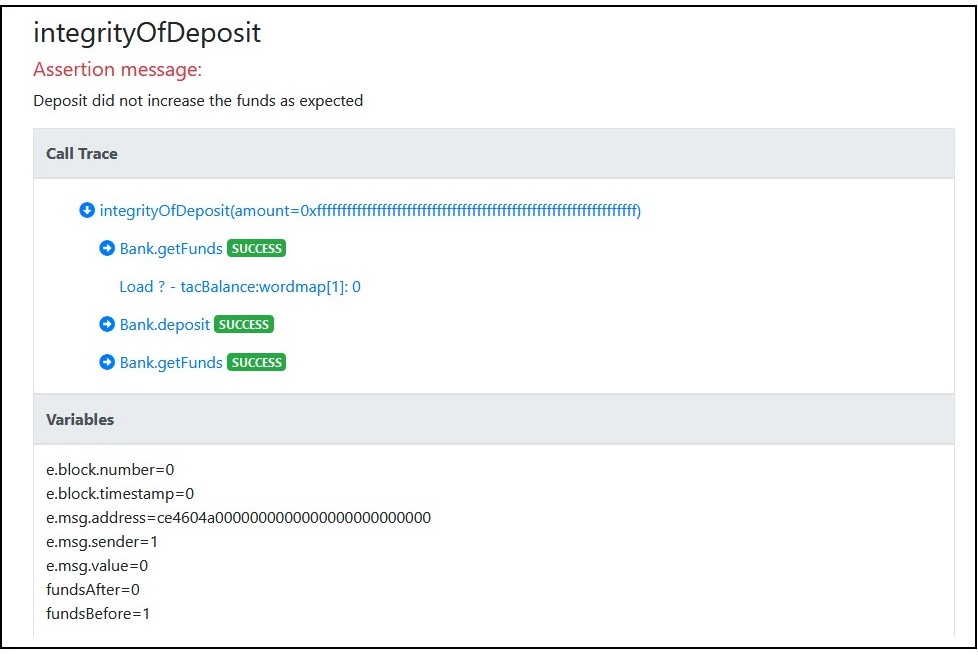

# Certora Prover Lesson 1 


## Overview of technology
The Certora Prover is based on well-studied techniques from the formal verification community. 
Specifications define a set of rules that call into the contract under analysis and make various assertions about their behavior. 
These rules, together with the contract under analysis, are compiled to a logical formula called a verification condition, which is then proved or disproved by an SMT solver. 
If the rule is disproved, the solver also provides a concrete test case demonstrating the violation.

The rules of the specification play a crucial role in the analysis. Without good rules, only very shallow properties can be checked (e.g. that no assertions in the contract itself are violated). 
To make effective use of Certora Prover, users must write rules that describe the high-level properties they wish to check of their contract. 
Here we will learn to think and write high-level properties


## Example

Lets take as an example a very simple Bank implementation ([Bank.sol](Tutorials/Lesson1/Bank.sol))
implemented with a mapping from users to their funds, and the total funds deposited in the system. The basic operations are `deposit` `transfer` and `withdraw`.

## A basic rule

For the function 'deposit' a basic property is:  _can one lose/gain money during deposit?_
The rule in [integrityOfDeposit.spec](Tutorials/Lesson1/IntegrityOfDeposit.spec) verifies this property. 
It verifies that the funds of msg.sender is the sum of his funds before and the amount passed.  
Formal verification can provide complete coverage of the input space, giving guarantees beyond what is possible from testing alone.
First, all possible inputs to the deposit function are taken into account.
Also, all possible calling context (msg.sender , timestamp, block number, ...) represented in the env structure. 
Also, the initial state can contain any value for the current funds of the msg sender.

To run this rule:

```sh
certoraRun Bank.sol:Bank --verify Bank:IntegrityOfDeposit.spec
```

This is a basic run on one contract, verifying all rules in the specification file. 
Later on, we will see options to analyze a system containing many solidity files. 

Local solidity files are compiled, specification file is check for syntax error,  all is compressed and sent to Certora’s web server.
Various information is printed to the console and an email is sent when the process is finished.
At the end, the output will look similar to this:
```
…
Status page: https://vaas-stg.certora.com/jobStatus/23658/e145eb5d7d5f2dea1f72?anonymousKey=f49a8d71d3d17288d8405c015
Verification results: https://vaas-stg.certora.com/output/23658/e145eb5d7d5f2dea1f72/?anonymousKey=f49a8d71d3d17288d8405c0150
Prover found violations:
[rule] callTraceProblem
[rule] integrityOfDeposit
```
Follow the Verification results to see the results.

Certora Prover help understanding violation of properties. 
First you see a table with the verification results.  


For each rule, it either displays a thumbs-up when it formally proved or a thumbs-down when it is violated.

Click the rule name to see a counter example violating the rule.

 

The counter example shows values of the parameters to the rule, a call trace and the variables in the rule.
Drill down into the call trace, to see which functions were called.
Notice the values of variables.  
So, what’s the bug?

Lets “fix” the code and rerun:
```sh 
certoraRun BankFixed.sol:Bank --verify Bank:IntegrityOfDeposit.spec
```


